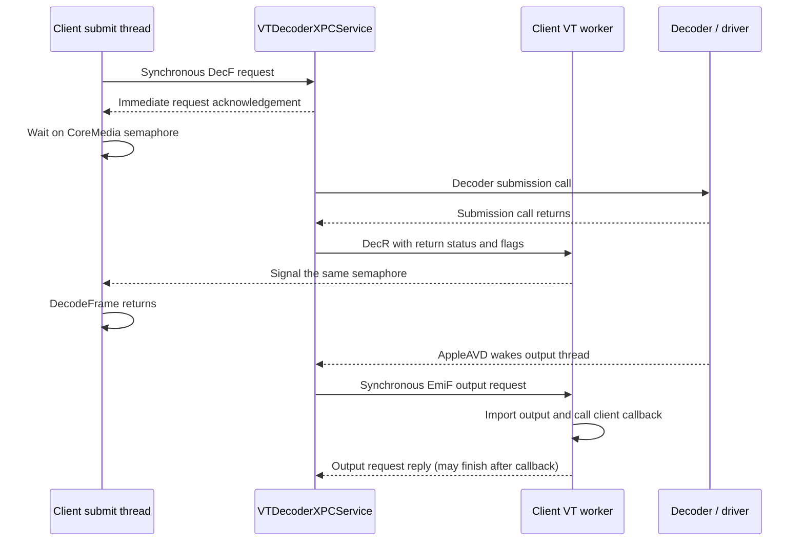

# VideoToolbox wait dependencies at 4K60

This follows the [VT interval investigation](vt-interval-investigation.md) on
the same M3 and macOS 26.6.2. The waits are part of a two-stage decoder-service
submission protocol. They are not evidence of an idle client thread that can
be made to finish decoding sooner just by changing its priority.

The analysis resolves the original HEVC SDR capture's 480 steady frames and
uses a fresh native-output capture to identify the remote process as
`VTDecoderXPCService`. Instrumented timings describe these traces; they are
not a new performance comparison with the uninstrumented native-output PR.

## What wakes the submitting thread



There is **one synchronous XPC request on the submitting thread per frame**,
represented by two Mach syscall rows: send and receive. The earlier count of
two submit-thread XPC-attributed syscalls must not be interpreted as two
independent requests. Later output delivery makes a separate synchronous
`EmiF` request from the service. Its receive syscall may finish after the
client callback; that tail is excluded from submission-to-callback latency.
The diagram describes the protocol, not a scaled timing plot.

For all 480 steady frames, the submitting thread's one condition-variable
wait matches exactly one local signal on the same condition address. The
signal's thread also equals the scheduler's recorded waker, and the wake
occurs inside that signal syscall. Matching installed CoreMedia code resolves
the wait to `FigSemaphoreWaitRelative` and the signal to `FigSemaphoreSignal`.

The matching VideoToolbox image receives `DecR`, stores the service decoder
call's status and flags, and signals the semaphore. This is a notification
that the decoder's submission call returned; final frame output arrives
separately. The public asynchronous flag permits output after the API returns.
It does not promise a nonblocking submission call.
[Apple's decode API contract](https://developer.apple.com/documentation/videotoolbox/vtdecompressionsessiondecodeframe%28_%3Asamplebuffer%3Aflags%3Ainfoflagsout%3Aoutputhandler%3A%29)
describes that distinction.

## Where the time goes

These are medians from the original instrumented HEVC SDR cohort. Rows are
different, sometimes overlapping intervals; do not add their medians.

| Observed interval | Median | Interpretation |
| --- | ---: | --- |
| VT submission to callback, raw timestamps | 2.831 ms | Whole measured VT interval |
| VT API call, raw timestamps | 0.832 ms | Submission, acknowledgements and local work |
| Synchronous XPC send through receive | 0.257 ms | One request/reply span |
| Condition-variable wait | 0.495 ms | Wait for the service decoder call to return |
| Service's first submission IOKit call through acknowledgement end | 0.382 ms | Substantial service work overlaps the condition wait |
| Service acknowledgement end to local condition signal start | 0.094 ms | Message delivery and local handling; not pure scheduling delay |
| VT return to first recorded service output IOKit call | 1.490 ms | Largest unresolved gap |
| VT return to AppleAVD kernel wake of service output thread | 1.462 ms | Waiting for decoder/driver notification |
| AppleAVD wake to first service output IOKit call | 0.028 ms | Service scheduling and resumed execution |
| First recorded service output IOKit call to callback | 0.498 ms | Service output processing plus client delivery |
| Client IOSurface lookup syscall | 0.014 ms | A small part of output import |
| Last callback-thread runnable interval before callback | 0.012 ms | Waiting to receive CPU time |

All 480 service output intervals have exactly one scheduler wake from the
kernel's named `AppleAVD` thread. The service output thread spends 98.35% of
their summed wall time Blocked; its median runnable time is only 0.010 ms.
This places the dominant gap before the decoder/driver notification, rather
than in the service's subsequent CPU scheduling.

This is **not a hardware execution timer**. The pre-notification gap can include
decoder execution, firmware/driver work and notification latency. The first observed
output IOKit call is not necessarily the instant the hardware finished.
Service events are matched in nonoverlapping paced frame windows rather than
by decoded XPC request IDs. The condition-object and scheduler-waker joins
provide stronger causal evidence for the local wake.

The service's output stack also includes CoreVideo metadata and attachment
processing. Those stack frames do not establish a pixel copy. Likewise,
`IOConnectCallMethod` syscall arguments do not expose the driver's selector
or payload, so this analysis does not invent names for the driver operations.

## Independent native-output capture

The fresh run completed 1,200/1,200 frames. Recording started after the replay
and decoder service were already running so Instruments recorded their names.
It contains **721 exact joined frames (221–941), with no interior omissions**;
the other 479 frames are outside the captured subset. The original analyzer's
full-run qualification remains false for this partial capture. The follow-up
analyzer qualifies only the contiguous exact subset and rejects interior gaps,
bad payloads, duplicate identities and failed replay accounting.

Missing framework stack names were restored through 62 exact address aliases,
verified against the recorded image UUIDs and installed image load addresses.
All 721 frames reproduce the submission request/semaphore sequence, matching
local condition signal, separate output request and AppleAVD output wake.

| Native-output trace interval | Median |
| --- | ---: |
| VT submission to callback, raw timestamps | 2.631 ms |
| VT API call, raw timestamps | 0.670 ms |
| Condition wait | 0.370 ms |
| Return to AppleAVD wake | 1.470 ms |
| AppleAVD wake to first service output IOKit call | 0.026 ms |
| First service output IOKit call to callback | 0.452 ms |

The output thread is Blocked for 98.40% of the summed return-to-first-output-I/O
interval. Four submission IOKit calls appear per native-output frame, versus
six in the older canonical-output trace. This is a difference between separate
instrumented cohorts, not a controlled estimate of the native-format benefit.
The repeated uninstrumented comparison in the original investigation remains
the performance evidence. The stable finding here is the protocol and the
roughly 1.47 ms delay before the AppleAVD notification.

## Implications for the client

* Switching from a callback function to an output-handler block does not
  avoid the handshake: both public entry points reach the same helper in
  this installed VideoToolbox build. The async flag is forwarded to the
  remote decoder while the acknowledgement sequence remains in place.
* Thread priority is unlikely to recover the missing milliseconds in this
  capture. The submitting thread has about 25 microseconds of runnable time
  during its call, and the final callback wake has about 12 microseconds.
  This does not rule out scheduling problems under a different system load.
* A dedicated, bounded decode worker can keep the network receive thread
  from blocking on VT submission. Its benefit would be receive responsiveness
  and overlap with other work; moving the same call to another thread does
  not itself shorten submission-to-callback latency. Measure admission delay
  from the complete access unit as well as the VT interval.
* The main remaining targets are the decoder/driver output gap and output
  delivery. Native surfaces already improve the latter path in the separate
  uninstrumented experiment. Eliminating the caller's wait does not eliminate
  the work that produces the frame: output still arrives roughly 1.97 ms
  after return in this trace.

## Internal options tested in isolation

An isolated copy of the source tested two additional internal controls using
normal application calls. No OS protections or entitlements were changed.
The public decoder source and the native-output PR remain unchanged.

| Probe | HEVC SDR/HDR and AV1 SDR/HDR result |
| --- | --- |
| Private `VTDecompressionSessionCreateWithOptions`, with the exported `AllowClientProcessDecode` key in its session-options dictionary | Creation succeeds, but `UsingSandboxedVideoDecoder` still reads `true`; each run starts a new `VTDecoderXPCService`. The request does not select in-process decoding. |
| Internal `EnableIOFenceDecode` session property set to `CFNumber(1)` | Setter and getter both return `-12900` on every tested codec/depth pair. No effective fence mode is observed. |

The public `VTDecompressionSessionCreate` passes null session options to the
internal creation function in this installed build. Placing this key in an
unrelated public dictionary would not be evidence of an effective request.
The probe used the actual exported key and verified both property readback
and process creation rather than relying on a successful return code.

The final probe cohort contains **12 exact correctness passes, 1,440 outputs,
and maximum pixel-code error zero**, covering baseline, client-process request
and fence request for all four codec/depth pairs. These runs also check
hardware decoding, native IOSurface/Metal output and retained ownership. They
are capability/correctness probes, not performance runs. Neither candidate
changed the intended path, so neither was promoted to a performance change.
See [probe evidence](evidence/vt-private-options-probe.json) and its
[isolated source patch](evidence/vt-private-options-probe.patch). The patch is
an installed-build diagnostic artifact, not a supported API or shipping change.

## Evidence and limits

[Installed-image symbol evidence](evidence/vt-wait-symbols.json) records UUIDs,
address mapping, the single-request correction and the acknowledgement
interpretation. Private function names and message semantics are findings
about this installed OS build, not stable API contracts.

[Dependency aggregates](evidence/vt-wait-dependencies.json) contain both
cohorts' match counts, timing distributions, state coverage and source hashes.
The new supported client-side latency reduction established by this follow-up
is **none**. The 1 ms goal remains unmet. The evidence narrows the next useful
investigation to decoder/firmware/driver completion timing and output delivery;
it does not establish a universal hardware limit.

Raw traces, disassembly, frame identities and unrelated system-process data
remain in ignored `results/vt-wait-dependencies/`. The portable aggregates
contain the relevant measurements and source hashes.

## Reproduction

Use `scripts/analyze-vt-profile.py` first to join signposts to replay CSV.
Then analyze the existing original capture without running a decoder:

```sh
python3 scripts/analyze-vt-waits.py \
  --prefix results/vt-profile/hevc-system \
  --joined results/vt-profile/all-joined-frames.json \
  --join-summary docs/evidence/vt-profile-analysis.json \
  --output results/vt-wait-dependencies/reproduced-hevc-system.json \
  --local-output results/vt-wait-dependencies/reproduced-hevc-system-local.json
```

For the fresh capture, use the `hevc-native-live` prefix, its `-joined.json`
and `-profile.json`, and
`--stack-symbols results/vt-wait-dependencies/hevc-native-stack-symbols.json`.
Choose unused output paths to preserve prior evidence. Raw trace exports and
aliases are local artifacts; do not reuse an address map for another OS image
or capture without verifying its UUIDs and load addresses.

```sh
python3 tests/vt_profile_analysis.py
python3 tests/vt_wait_analysis.py
python3 tests/vt_wait_states.py
```

The private probe patch applies to commit `f1a3bc1` in an isolated source copy.
Build that copy with `MAV_VT_EXPERIMENTS=ON`, then run `mav-replay` correctness
mode with `--reference-raw` pointing to the corresponding fixture reference.
The patch's `MAV_PRIVATE_CLIENT_PROCESS=1` requests the internal creation
option; `MAV_PRIVATE_IOFENCE=1` separately attempts the numeric fence property.
`MAV_PRIVATE_PROBE_HOLD=1` pauses for process observation before frame submission.
Use the patched binary with both controls zero as the baseline. Gate on actual
readback, process identity, hardware validation and pixel equality; never
interpret a successful creation call or an earlier callback alone as a win.
